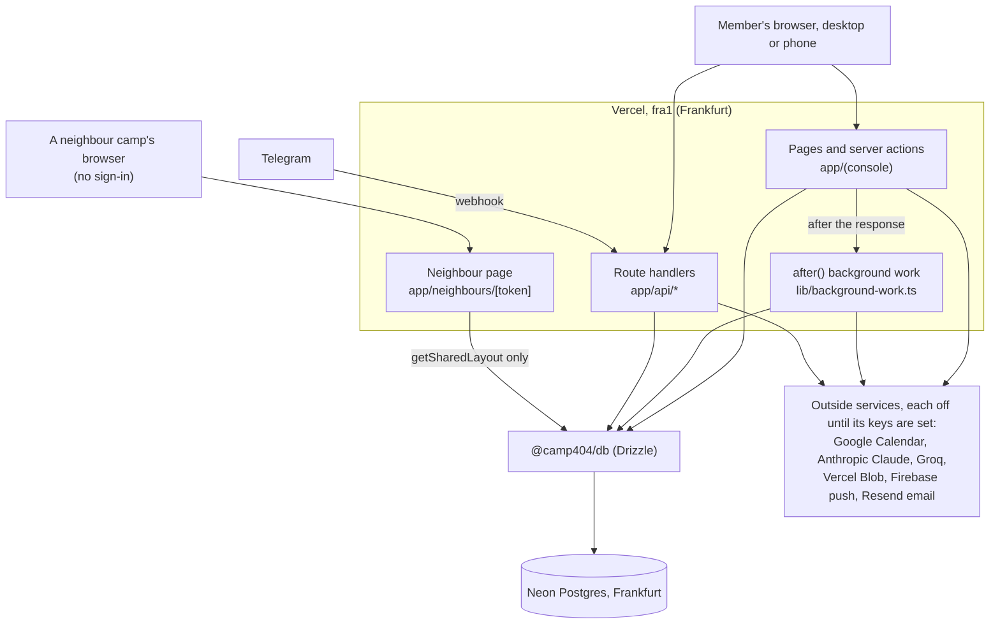
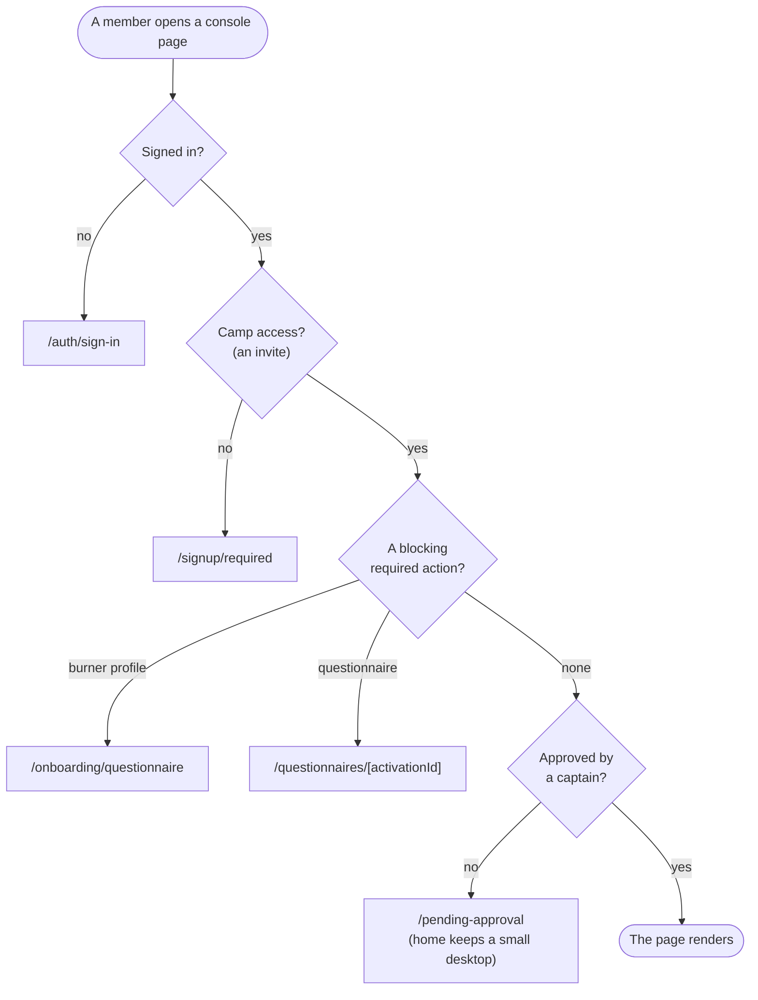
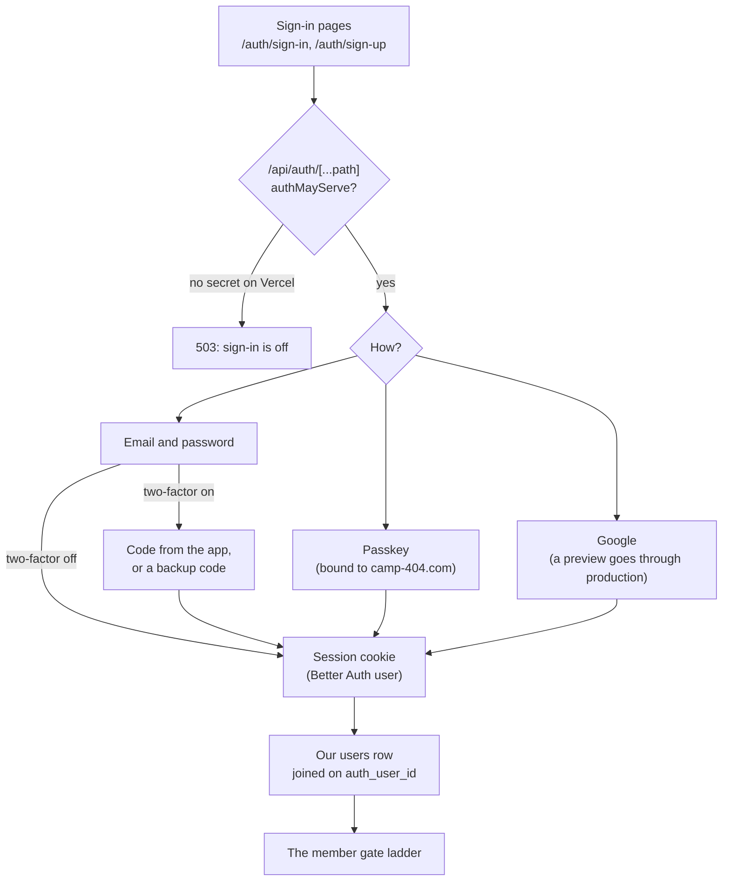
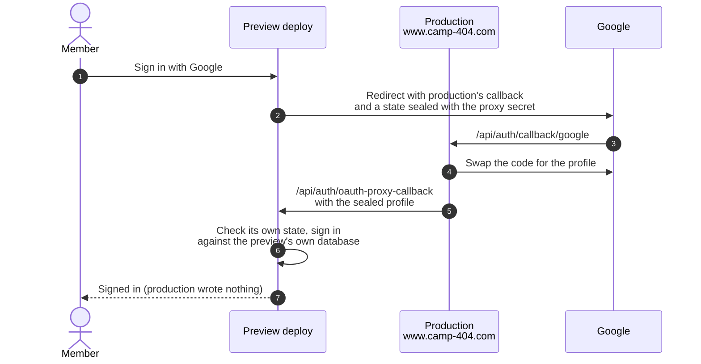
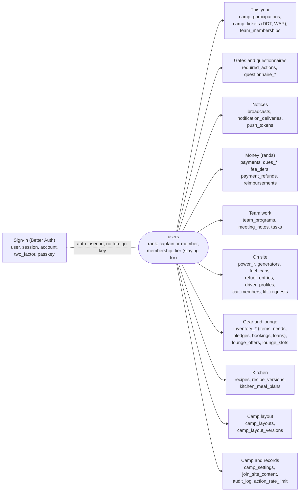
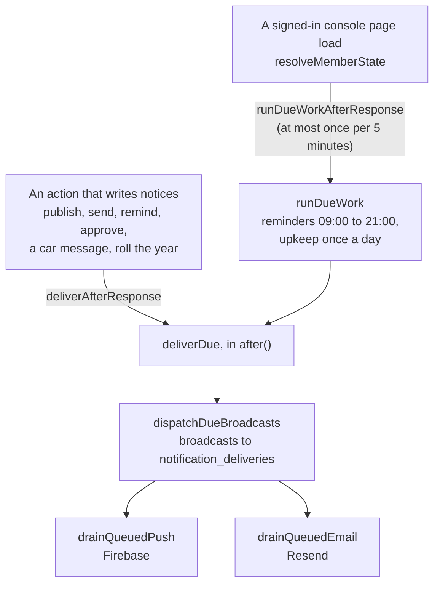

# How Camp 404 fits together

A map of the running system, for people and agents who are new to the code.
Each diagram was checked against the code on 2026-09-29. The rules behind
these pieces live in [`AGENTS.md`](../AGENTS.md); where the two disagree, fix
this page.

## Request flow

Both apps run on Vercel in `fra1` (Frankfurt), beside the Neon database
(`apps/web/vercel.json`, `apps/join/vercel.json`). A console page is a server
component; a change is a server action; files, voice and webhooks come in
through route handlers under `apps/web/app/api/`. One page outside the console
needs no sign-in: the neighbour page, `app/neighbours/[token]`, which a captain
turns on to show other camps the site plan (see Camp layout below).

| Service         | Used for                                            | Where                                                          |
| --------------- | --------------------------------------------------- | -------------------------------------------------------------- |
| Google Calendar | The camp calendar, meeting events, Today            | `apps/web/lib/google-calendar.ts`, `lib/camp-calendar.ts`      |
| Anthropic       | Recipe proofreading; turning a report into an issue | `lib/recipe-proofread.ts`, `lib/feedback-ai.ts`                |
| Groq            | Voice to text                                       | `lib/groq.ts`, `app/api/voice/transcribe`                      |
| Vercel Blob     | Profile photos, proof of payment, form images       | `app/api/uploads/*`, `app/api/avatar`, `app/api/payment-proof` |
| Firebase        | Push notifications                                  | `lib/firebase-admin.ts`                                        |
| Resend          | Notice emails and sign-in emails                    | `lib/email.ts`, `packages/auth/src/email.ts`                   |
| GitHub          | "Report a problem" files an issue                   | `app/feedback/actions.ts`                                      |
| Telegram        | Inbound webhook only; outbound is built but off     | `app/api/telegram/webhook`, `@camp404/telegram`                |

Each one turns itself off when its keys are missing; the captains' System
status page (`/captains/system`) shows which are on.

## The member gate ladder

Every member page calls `requireMemberPage()` (`apps/web/lib/member-gate.ts`)
and is sent to the first rung it fails. A blocking requirement is a
`required_actions` row, never an ad-hoc `redirect()`. Two pages skip the
ladder and need only a sign-in: the inbox (`/notifications`) and an
announcement (`/announcements/[id]`), because push and email links land there.

A blocking questionnaire draws over an inert copy of the desktop, but the
server's redirect is still the gate.

## Sign-in

Sign-in is self-hosted Better Auth (`packages/auth`), served at
`/api/auth/[...path]`. On a Vercel deployment with no `BETTER_AUTH_SECRET`,
`authMayServe` turns it off. Our `users` table joins Better Auth's `user` on
`users.auth_user_id`, with deliberately no foreign key, so erasure can delete
the sign-in and keep a "Lost Cat" stub. An account whose email is not yet
confirmed cannot add a passkey or two-factor (`email-proof.ts`).

Google calls back only production's registered address, so a preview signs in
with Google through production (Better Auth's OAuth proxy,
`packages/auth/src/oauth-proxy.ts`). It is off unless
`AUTH_OAUTH_PROXY_SECRET` is set, and only this project's preview hosts are
accepted. AGENTS.md lists what the shared secret opens.

## The data model, in groups

`packages/db/src/schema.ts` is the one hand-written source; migrations are
generated from it. This shows the main groups, not every table. Most member
data hangs off `users.id`. Tables marked "this year" carry a `cycle` column
and every read filters on the camp's current burn year.

- **Ranks are stored; roles are derived.** `users.rank` is `captain` or
  `member`. A team lead comes from `team_memberships.is_lead`, a driver from
  `driver_profiles`.
- **Two kinds of questionnaire.** Code questionnaires write their own tables
  (`burner_profiles`, …). Builder questionnaires keep their definitions and
  answers in `questionnaire_definitions` and `questionnaire_responses`.
- **Team tools: every member reads, the owning team edits.** Each tool's
  "who may change it" is one pure function in `@camp404/core` that fails
  closed: a captain or a lead of that team this year (`canEditPower`,
  `canEditTransport`, `canEditInventory`, `canRunLounge`, `canEditLayout`,
  `canManageMoney`, `canEditTeamProgram`).
- **The neighbour page reads an allowlist.** `getSharedLayout`
  (`@camp404/db/camp-layout`) returns only `neighbourView`'s fields (each
  piece's kind, size and place) and arrival counts per day. The link is off
  until a captain turns it on (`canShareLayout`, audited).
- **Private columns are encrypted.** ID and passport numbers and bank details
  are AES-256-GCM encrypted at the write boundary
  (`packages/db/src/crypto.ts`).

## Notices, and why nothing runs on a schedule

The camp is on Vercel's free plan, so there are no cron jobs. Work happens
right after the action that caused it, or lazily on a page load, always in
`after()` so nobody waits (`apps/web/lib/background-work.ts`).

- A broadcast is claimed by setting `dispatched_at`, and fan-out writes one
  `notification_deliveries` row per member (a unique index stops doubles).
- The push and email drains lock their rows `FOR UPDATE SKIP LOCKED`, so two
  servers never send the same notice.
- The page-load run is guarded by a row in `action_rate_limit`, so it runs at
  most once every five minutes across every server. Reminders go out only
  between 09:00 and 21:00 camp time; the upkeep (encrypt leftover plaintext ID
  numbers, delete orphan photo folders on production) runs once a day.
- None of it runs under `E2E_TEST_MODE`. Push and email wait in the queue
  until Firebase and Resend are configured.
- A recipe run follows the same rule: a reviewer's click starts it in
  `after()`, and a run stuck over 10 minutes is reset when a Kitchen page
  loads.
