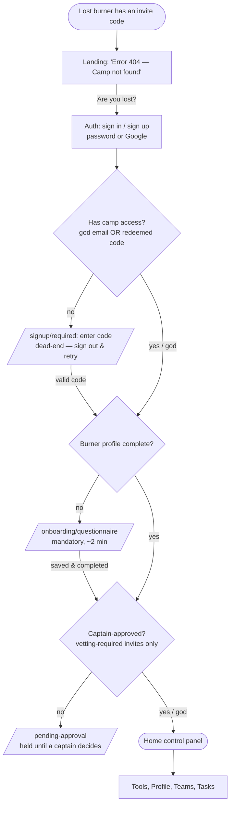
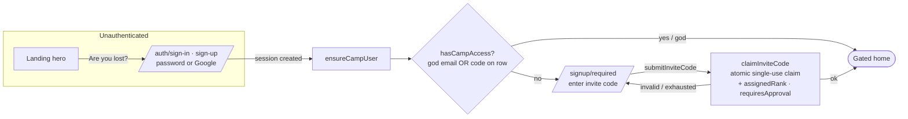
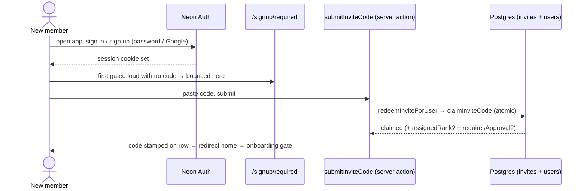
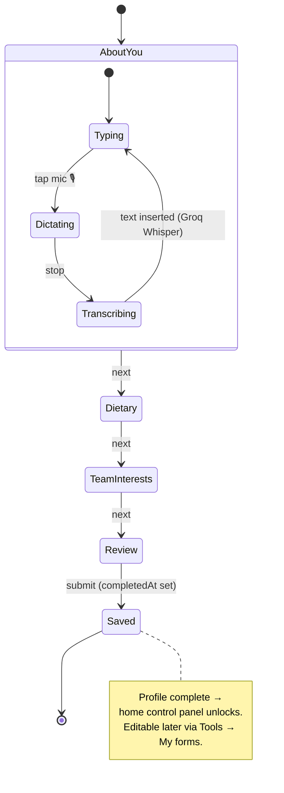
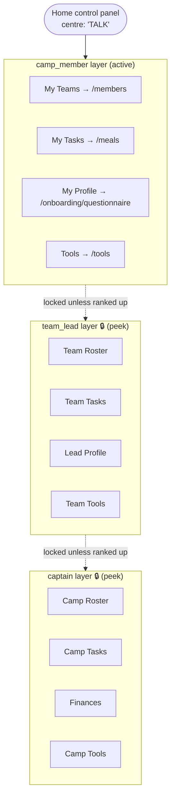
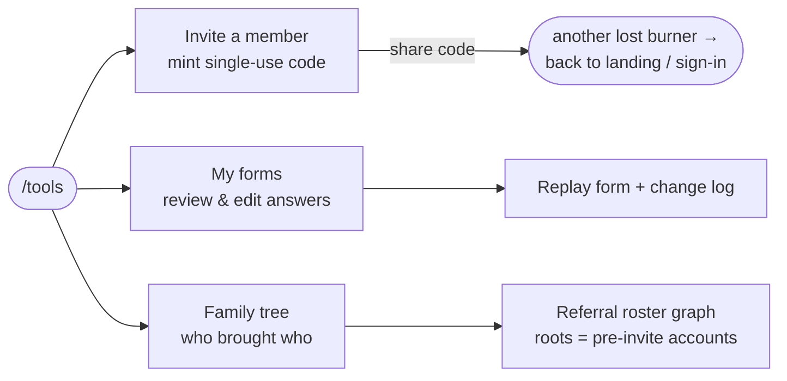
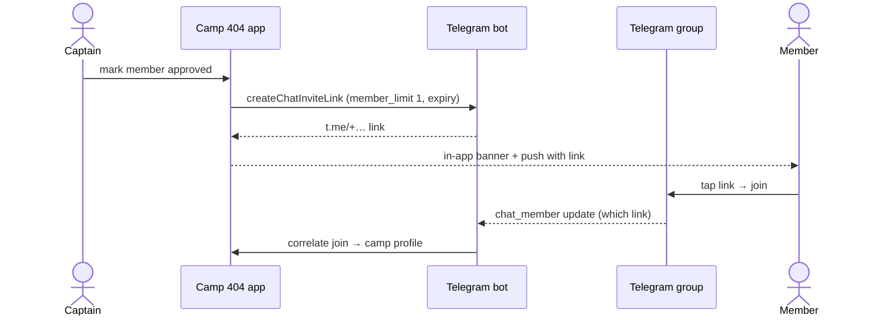
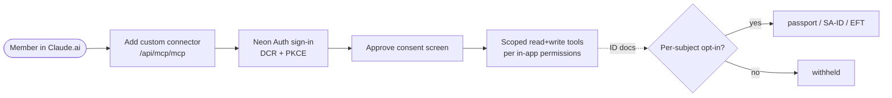
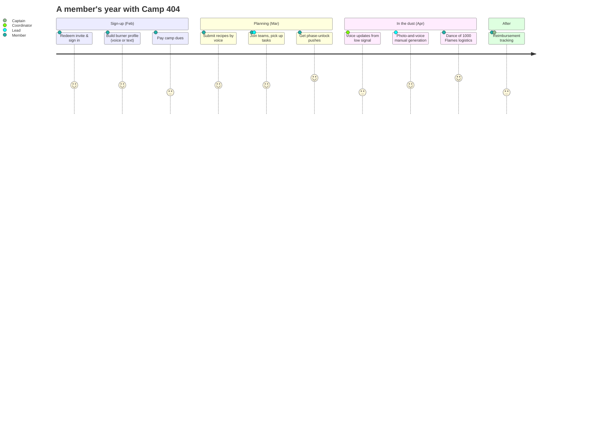

# Camp 404 — User Journey

> How a person moves through the Camp 404 app: from an invite link in their
> inbox to an active, profiled camp member navigating the control panel —
> plus the planned surfaces (Telegram, MCP, meal planning) the journey grows
> into.

This document maps the **user journey** as it exists in the codebase today
(the invite → auth → onboarding → control-panel spine) and sketches the
journeys still on the roadmap per [`brief.md`](./brief.md),
[`telegram-bot-proposal.md`](./telegram-bot-proposal.md), and
[`mcp-tooling-proposal.md`](./mcp-tooling-proposal.md).

Legend used throughout: **solid** paths are implemented; **dashed** paths
and 🔭-marked sections are planned / proposed.

---

## 1. The whole journey at a glance

The app is **invite-only** and gated in four layers. A person signs in
first; every authenticated request then flows through the same checks
(`hasCampAccess` → a completed burner profile → captain approval) before a
member reaches the home control panel.

The four gates, in order, are enforced on **every** protected page
(`app/page.tsx` is the canonical chain; `tools/*`, `family-tree`,
`onboarding/*` repeat it):

1. **Authenticated?** — Neon Auth (Better Auth) session cookie. No session
   → landing hero / sign-in.
2. **Has camp access?** — `hasCampAccess()`: either a `GOD_EMAILS` address
   or an invite code redeemed onto the user's row. No access →
   `/signup/required`, where the code is entered (see §2).
3. **Profile complete?** — a `burner_profiles` row with `completedAt` set.
   Incomplete → `/onboarding/questionnaire`.
4. **Captain-approved?** — `isApproved()`. A member who redeemed a
   vetting-required invite is held at `/pending-approval` until a captain
   approves or rejects them; god accounts and non-vetting invites pass
   straight through.

---

## 2. Access & authentication

Neon Auth creates an identity the moment someone signs in — especially via
Google — so the app **cannot** gate sign-up behind an invite code. Instead
the invite check lives *after* auth: a signed-in user with no code on file
is bounced to `/signup/required`, where they enter a code that is **claimed**
atomically and stamped onto their camp row. (There is no longer a pre-auth
`/signup` page or a `camp404_invite` cookie — that earlier design was removed
when the gate moved post-auth.)

Key behaviours worth knowing:

- **The invite-code form lives on `/signup/required`, post-auth.** A
  signed-in user with no code can't reach the questionnaire until they enter
  a valid one; the screen's only other exit is to *sign out and start over*
  (today just a link to Neon's hosted sign-out — there's no programmatic
  sign-out control).
- **Claiming is the authoritative race-winner.** If two browsers race for
  the last remaining use of a DB code, `claimInviteCode` lets exactly one
  win (a single atomic `use_count` increment). Env `INVITE_CODES` are
  unlimited bootstrap codes — a pure validity check that never stamps a rank.
- **Captain-tier invites** can stamp an `assignedRank` and a
  `requiresApproval` flag on the code, both applied at claim time; the latter
  routes the redeemer through the captain-approval gate (gate 4 in §1).
- **God accounts** (`GOD_EMAILS`) bypass the invite *and* approval gates.

### Sequence: redeeming an invite end-to-end

---

## 3. Onboarding — the burner profile

Once past the access gate, a member **must** complete the burner-profile
questionnaire before anything else unlocks. It's a multi-page wizard
(`QUESTIONNAIRE`, versioned, e.g. `2026.05.24-v7`) covering: about-you
(DOB, phone), dietary needs (dislikes, allergies), and team interests —
the team-interest sliders later drive which follow-up questionnaires
(kitchen, structures, …) a member is activated for.

A standout: **any free-text / long field can be filled by voice.** The
dictate button records audio and posts it to `/api/voice/transcribe`,
which runs Groq Whisper Large v3 Turbo — built for the German member
submitting from Berlin and the coordinator with dusty hands in the Karoo.

After completion the member can revisit and edit answers via
**Tools → My forms**, which replays the wizard pre-filled and records a
**change log** (field-by-field `from → to`) on every edit — no old
versions kept, just the running history.

---

## 4. The home control panel & rank-based surfaces

The home page is a **control panel** of four quadrants whose contents
depend on the viewer's `rank`. Members see their own layer plus a
visible-but-locked peek at the Team Lead and Captain layers above them.

From the **Tools** quadrant a member reaches the uncategorised toolbox:

The **family tree** visualises referral lineage: roots are accounts that
pre-date the invite system, and every other branch is one invite-code
redemption — so the journey is recursive. Each member who invites someone
becomes a node in the next person's origin story.

---

## 5. 🔭 Journeys on the roadmap

The brief and proposals describe surfaces beyond the current invite→profile
spine. These are **planned**, not yet built.

### 5a. Telegram — "you're in" and "the gates just opened"

When a captain approves a member, the camp bot mints a single-use Telegram
invite link; the member taps it, joins the members-only group, and the bot
links their Telegram identity back to their camp profile. A broadcast
channel carries phase-unlock / dust-day / last-call announcements.

### 5b. MCP connector — chat against your camp data

A member adds the camp's MCP endpoint as a custom connector in Claude.ai,
signs in through the same Neon Auth flow, approves a consent screen, and
the model gains read + write tools scoped to that user's in-app
permissions (ID documents gated behind a per-user opt-in).

### 5c. The full operational vision

Per the brief, the journey ultimately spans the camp's whole year — these
hang off the **My Tasks**, **My Teams**, and **Tools** quadrants as they're
built out:

---

## 6. Where each journey lives in the code

| Journey step | Route / file |
|---|---|
| Landing hero | `apps/web/app/landing-hero.tsx` |
| Invite gate | `apps/web/app/signup/`, `lib/access-control.ts` |
| Invite dead-end | `apps/web/app/signup/required/page.tsx` |
| Auth (sign-in/up) | `apps/web/app/auth/[path]/page.tsx` |
| Access + profile gating | `apps/web/lib/users.ts` (`hasCampAccess`, `getBurnerProfile`) |
| Onboarding wizard | `apps/web/app/onboarding/questionnaire/`, `lib/questionnaire.ts` |
| Voice dictation | `apps/web/components/voice/`, `app/api/voice/transcribe/route.ts` |
| Home control panel | `apps/web/app/page.tsx` |
| Tools | `apps/web/app/tools/` |
| My forms + change log | `apps/web/app/tools/forms/` |
| Family tree | `apps/web/app/family-tree/` |
| 🔭 Telegram | `app/api/telegram/`, `docs/telegram-bot-proposal.md` |
| 🔭 MCP | `app/api/mcp/`, `docs/mcp-tooling-proposal.md` |
</content>
